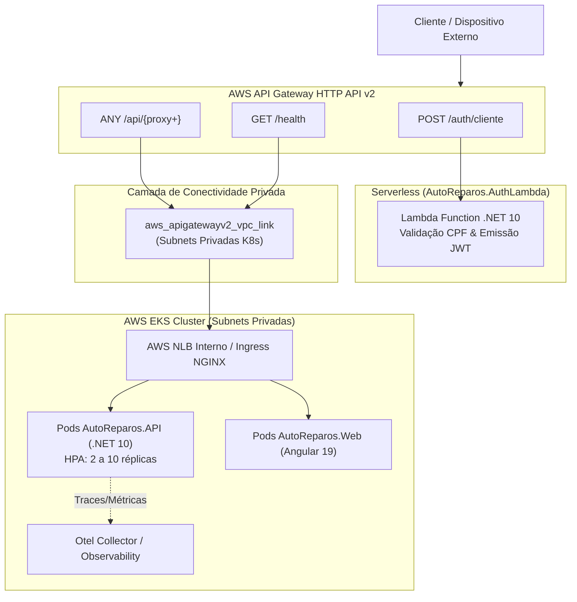

# AutoReparos.Infra.K8s - Infraestrutura Kubernetes AWS EKS e API Gateway v2 (Terraform & Helm)

> **Projeto:** AutoReparos - Sistema Integrado de Oficina Mecânica  
> **Fase:** Fase 3 Tech Challenge (13SOAT / 15SOAT FIAP)  
> **Componente Obrigatório:** Repositório 2/4 da Arquitetura Multi-Repo  
> **Tecnologias:** Terraform >= 1.7, AWS EKS, AWS API Gateway HTTP API v2, Helm 3, NGINX Ingress, HPA, OpenTelemetry.  
> **Repositório Oficial:** [Grupo78-PosTech-15SOAT/AutoReparos.Infra.K8s](https://github.com/Grupo78-PosTech-15SOAT/AutoReparos.Infra.K8s)

---

## 1. Visão Geral e Responsabilidades

Este repositório contém a definição completa de **Infraestrutura como Código (Terraform)** e **Empacotamento de Aplicações Kubernetes (Helm)** para a plataforma AutoReparos.

Ele atende integralmente aos requisitos da Fase 3 do Tech Challenge FIAP SOAT:
1. **Cluster Kubernetes Gerenciado (AWS EKS):** Provisionamento de cluster EKS com Managed Node Groups distribuídos em subnets privadas multi-AZ e auto-scaling configurado via Horizontal Pod Autoscaler (HPA).
2. **AWS API Gateway v2 (HTTP API):** Ponto de entrada unificado que implementa:
   - Rota `POST /auth/cliente` integrada diretamente com a **AWS Lambda** serverless (`AutoReparos.AuthLambda`).
   - Rota `ANY /api/{proxy+}` configurada como proxy HTTP reverso para o Network Load Balancer (NLB) e Ingress Controller do EKS.
3. **Rede VPC Segura:** Subnets públicas (NAT Gateways, Load Balancers) e subnets privadas (Node Groups do EKS e RDS) com isolamento estrito.
4. **Registro de Contêineres (AWS ECR):** Repositório privado com escaneamento de vulnerabilidades ativado para imagens Docker da aplicação.
5. **Helm Charts Modulares:** Empacotamento para API backend, Frontend Web Angular, Ingress Controller e stack de observabilidade (Jaeger, Prometheus, Loki, Otel Collector).

---

## 2. Diagrama de Roteamento e Arquitetura de Nuvem (Zero-Trust)



---

## 3. Estrutura de Arquivos

```
AutoReparos.Infra.K8s/
├── .github/
│   └── workflows/
│       └── ci.yml                     # CI: Terraform fmt/validate + Helm lint
├── terraform/
│   ├── modules/
│   │   ├── vpc/                       # Topologia VPC, Subnets Públicas/Privadas, NAT GW
│   │   ├── eks/                       # EKS Cluster, OIDC, Managed Node Groups, HPA
│   │   ├── ecr/                       # AWS ECR para imagens da API e Web
│   │   ├── addons/                    # Metrics Server, VPC CNI, CoreDNS, EBS CSI
│   │   └── apigateway/                # AWS API Gateway HTTP v2 (/auth/cliente e /api/*)
│   ├── main.tf                        # Orquestração dos módulos Terraform
│   ├── variables.tf                   # Declaração de variáveis
│   ├── outputs.tf                     # Endpoints e identificadores exportados
│   ├── providers.tf                   # Configuração dos provedores AWS
│   └── terraform.tfvars.example       # Exemplo de parametrização
├── k8s/
│   ├── charts/
│   │   ├── api/                       # Deployment, Service, HPA da API .NET 10
│   │   ├── web/                       # Deployment, Service do Frontend Angular 19
│   │   ├── ingress/                   # Ingress NGINX com regras de roteamento
│   │   └── observability/             # Jaeger, Prometheus, Grafana, Loki
│   ├── Chart.yaml                     # Metadados do Helm Umbrella Chart
│   ├── values.yaml                    # Configurações padrão e desenvolvimento
│   └── values-production.yaml         # Configurações de produção na nuvem
├── .gitignore                         # Ignora .terraform/, *.tfstate, *.tgz
└── README.md                          # Este documento
```

---

## 4. Tabela de Variáveis Principais (Terraform)

| Variável | Tipo | Padrão | Descrição |
|---|---|---|---|
| `aws_region` | `string` | `"us-east-1"` | Região AWS |
| `cluster_name` | `string` | `"autoreparos-cluster"` | Nome do cluster Kubernetes EKS |
| `environment` | `string` | `"production"` | Ambiente de deploy |
| `vpc_cidr` | `string` | `"10.0.0.0/16"` | Bloco CIDR da VPC |
| `instance_types` | `list(string)` | `["t3.small"]` | Instâncias EC2 dos worker nodes |
| `desired_size` | `number` | `2` | Quantidade desejada de nós no Node Group |
| `max_size` | `number` | `4` | Limite máximo para escalonamento automático |
| `min_size` | `number` | `2` | Limite mínimo de nós |
| `lambda_function_arn` | `string` | `""` | ARN da Lambda para rota `/auth/cliente` |
| `lambda_function_name` | `string` | `""` | Nome da Lambda para concessão de permissão |
| `eks_ingress_url` | `string` | `"http://localhost:8080"` | URL de destino do Ingress NLB |

---

## 5. Deploy e Operação

### Provisionamento da Infraestrutura com Terraform

```bash
cd terraform/
terraform init
cp terraform.tfvars.example terraform.tfvars
terraform plan -out=tfplan
terraform apply tfplan
```

### Conectar o `kubectl` ao Cluster EKS

```bash
aws eks update-kubeconfig --region us-east-1 --name autoreparos-cluster
kubectl get nodes
```

### Deploy da Aplicação com Helm

```bash
cd ../k8s/
helm dependency update .
helm upgrade --install autoreparos . \
  -f values-production.yaml \
  --namespace autoreparos \
  --create-namespace
```

---

## 6. Testes Locais de Observabilidade com Docker Compose

Para validar os componentes da stack de telemetria (OpenTelemetry Collector, Prometheus, Jaeger, Loki e Grafana) antes do empacotamento com Helm, o repositório disponibiliza um `docker-compose.yml`:

```bash
# Iniciar a stack local de observabilidade
docker-compose up -d

# Acessar os painéis locais:
# - Grafana: http://localhost:3000 (admin / admin)
# - Jaeger UI: http://localhost:16686
# - Prometheus: http://localhost:9090
# - Loki: http://localhost:3100
# - OTLP Collector: gRPC na porta 4317 / HTTP na porta 4318

# Parar o ambiente
docker-compose down
```

---

## 7. Integração Contínua (CI/CD)

O repositório conta com pipeline automatizada no GitHub Actions (`.github/workflows/ci.yml`) com controle de concorrência e actions com commit SHA fixados:
- `Terraform Format & Validate`: Verifica padrões de formatação HCL e integridade sintática dos módulos de forma recursiva.
- `Helm Lint`: Executa análise estática de todos os templates Helm garantindo validação de schemas e dependências.
- `Terraform Plan & Apply`: Executado condicionalmente na branch `main` quando as credenciais AWS estiverem cadastradas nos Secrets da organização.

---

## 8. Governança e Arquitetura Multi-Repo

- **Isolamento Multi-Repo:** Repositório autônomo e focado em orquestração Kubernetes, provisionamento EKS e Gateway de roteamento de nuvem, exportando parâmetros de rede via AWS SSM Parameter Store (`/autoreparos/{environment}/vpc_id`, `/autoreparos/{environment}/subnets/private`, `/autoreparos/{environment}/security-groups/eks-nodes` e `/autoreparos/{environment}/apigateway/endpoint`).
- **Proteção de Branch:** Branch `main` protegida com obrigatoriedade de Pull Request, aprovação e status checks verdes antes do merge.
