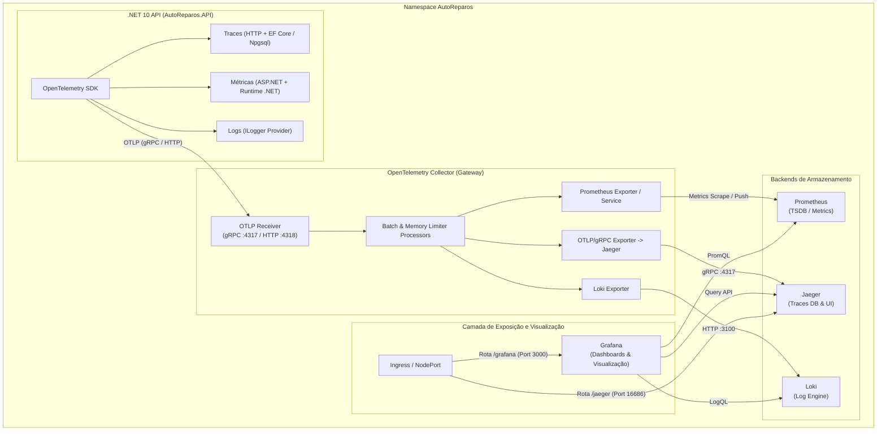

# Especificação Arquitetural de Observabilidade com OpenTelemetry (OTel)

**Projeto:** AutoReparos - Sistema de Oficina  
**Autor:** Antigravity (AI Coding Assistant) / Grupo 78  
**Data:** 2026-07-22  
**Status:** Em Validação (Etapa 4 - Feedback)

---

## 1. Visão Geral e Objetivos

Esta especificação define o plano de migração da infraestrutura de observabilidade raw (Prometheus e Grafana isolados) para uma arquitetura unificada baseada em **OpenTelemetry (OTel)** no ecossistema .NET 10 e Kubernetes (Helm).

### Objetivos Principais

1. **Desacoplamento de Provedores:** A aplicação `AutoReparos.API` emitirá os três pilares da observabilidade (Métricas, Traces e Logs) padronizados no formato **OTLP** (OpenTelemetry Protocol).
2. **Centralização no OTel Collector:** O OpenTelemetry Collector atuará no modo **Deployment / Gateway** como ponto central de recepção, processamento, enriquecimento e roteamento dos sinais de telemetria.
3. **Pilha de Observabilidade Completa:**
   - **Métricas:** Exportadas para o **Prometheus**.
   - **Traces:** Exportadas para o **Jaeger**.
   - **Logs:** Exportadas para o **Loki** (com integração do `ILogger` .NET).
   - **Painéis e Visualização:** Centralizados no **Grafana** (expondo também a UI do Jaeger).

---

## 2. Diagrama da Arquitetura (Mermaid)



---

## 3. Estrutura de Pastas e Arquivos Mapeados (Subchart & Modularização)

Para manter o Helm Chart principal enxuto e modularizado, a infraestrutura de observabilidade será separada em um **Subchart Helm dedicado** em `k8s/charts/observability/` (ou implantado de forma independente via `helm install observability ./k8s/charts/observability`).

Além disso, o Grafana será configurado com **Auto-Provisionamento Automático de Data Sources e Dashboards** (Prometheus, Jaeger, Loki e painéis pré-construídos para a API .NET 10), garantindo que ao abrir a interface gráfica do Grafana todos os dashboards estejam prontos para uso sem necessidade de qualquer importação manual.

```
AutoReparos/
├── k8s/
│   ├── Chart.yaml                                # Chart Principal (Aplicação & Banco)
│   ├── values.yaml
│   ├── values-production.yaml
│   ├── k8s_architecture_spec.md                  # Especificação Técnica de Observabilidade
│   ├── templates/                                # Manifestos da Aplicação
│   │   ├── _helpers.tpl
│   │   ├── deployment.yaml                       # API .NET
│   │   ├── service.yaml                          # API Service
│   │   ├── configmap.yaml                        # API Configs
│   │   ├── secret.yaml                           # API Secrets
│   │   ├── hpa.yaml                              # API HPA
│   │   ├── ingress.yaml                          # Ingress com rotas unificadas
│   │   ├── postgres-statefulset.yaml
│   │   ├── postgres-pv.yaml
│   │   ├── postgres-pvc.yaml
│   │   └── postgres-service.yaml
│   └── charts/
│       └── observability/                        # Subchart Helm de Observabilidade OTel
│           ├── Chart.yaml
│           ├── values.yaml
│           └── templates/
│               ├── _helpers.tpl
│               ├── otel-collector-deployment.yaml # OTel Collector Gateway
│               ├── otel-collector-configmap.yaml  # Configuração dos Pipelines OTLP
│               ├── otel-collector-service.yaml
│               ├── otel-collector-hpa.yaml
│               ├── prometheus-deployment.yaml     # Prometheus TSDB
│               ├── prometheus-configmap.yaml
│               ├── prometheus-service.yaml
│               ├── jaeger-deployment.yaml         # Jaeger Tracing UI/Storage
│               ├── jaeger-service.yaml
│               ├── loki-deployment.yaml           # Loki Log Engine
│               ├── loki-configmap.yaml
│               ├── loki-service.yaml
│               ├── grafana-deployment.yaml        # Grafana Dashboard Engine
│               ├── grafana-service.yaml
│               ├── grafana-datasources-configmap.yaml  # Auto-provisioning: Prometheus/Jaeger/Loki
│               ├── grafana-providers-configmap.yaml    # Auto-provisioning: Dashboard Providers
│               └── grafana-dashboards-configmap.yaml   # Dashboards JSON pré-configurados (.NET 10)
├── docker-compose.yml                            # Dev Local com dashboards provisionados
└── AutoReparos.API/
    ├── AutoReparos.API.csproj
    └── Program.cs
```

---

### 🎨 Auto-Provisionamento de Dashboards do Grafana

Os seguintes dashboards virão **100% pré-configurados e carregados automaticamente** no Grafana assim que a aplicação for iniciada:
1. **Overview da API .NET 10**: Taxa de requisições/segundo (RPS), Latência de respostas ($p_{50}, p_{95}, p_{99}$), Códigos de Status HTTP (2xx, 4xx, 5xx) e rotas Minimal API ativas.
2. **Runtime & Saúde da Aplicação**: Uso de CPU, consumo de memória Heap, estatísticas do Garbage Collector (GC) e filas de ThreadPool do .NET 10.
3. **Métricas de Banco de Dados & EF Core**: Duração e contagem de queries SQL via PostgreSQL/Npgsql.
4. **Visão de Traces & Logs**: Integração direta entre métricas de erro com visualização de spans no Jaeger e logs correlacionados do Loki.


---

## 4. Modelo de Configuração (`values.yaml`) e Segredos

No Helm, manteremos a divisão estrita entre `ConfigMap` para dados de pipeline/rotas e `Secret` para credenciais sensíveis (como senha do Grafana), populadas por pipeline ou variáveis de ambiente.

```yaml
# Trecho a ser integrado ao k8s/values.yaml

opentelemetryCollector:
  enabled: true
  replicaCount: 1
  image:
    repository: otel/opentelemetry-collector-contrib
    tag: "0.96.0"
  service:
    type: ClusterIP
    otlpGrpcPort: 4317
    otlpHttpPort: 4318
    metricsPort: 8888
  resources:
    requests:
      cpu: 100m
      memory: 128Mi
    limits:
      cpu: 500m
      memory: 512Mi
  hpa:
    enabled: true
    minReplicas: 1
    maxReplicas: 3
    targetCPUUtilizationPercentage: 80

observability:
  prometheus:
    enabled: true
    image: prom/prometheus:v2.51.0
  jaeger:
    enabled: true
    image: jaegertracing/all-in-one:1.55
  loki:
    enabled: true
    image: grafana/loki:2.9.5
  grafana:
    enabled: true
    image: grafana/grafana:10.4.1
    adminUser: "admin"

ingress:
  enabled: true
  className: nginx
  hosts:
    - host: "autoreparos.local"
      paths:
        - path: /
          pathType: Prefix
          backendService: autoreparos-api
          backendPort: 8080
        - path: /grafana
          pathType: Prefix
          backendService: grafana
          backendPort: 3000
        - path: /jaeger
          pathType: Prefix
          backendService: jaeger-ui
          backendPort: 16686

secrets:
  grafanaAdminPassword: "" # Preenchido via Secret obtido da pipeline/env
```

---

## 5. Impacto no Código-Fonte da Aplicação .NET

Para suportar **Métricas, Traces e Logs** via OpenTelemetry no .NET 10, faremos os seguintes ajustes pontuais no projeto `AutoReparos.API`:

### A. Pacotes NuGet no `AutoReparos.API.csproj`

Adição das bibliotecas oficiais do OpenTelemetry:

- `OpenTelemetry.Extensions.Hosting` (v1.10.0+)
- `OpenTelemetry.Instrumentation.AspNetCore`
- `OpenTelemetry.Instrumentation.Http`
- `OpenTelemetry.Instrumentation.EntityFrameworkCore` / `Npgsql.OpenTelemetry`
- `OpenTelemetry.Exporter.OpenTelemetryProtocol` (Exporter OTLP)

### B. Atualização no `Program.cs`

Configuração do provedor unificado de telemetria:

```csharp
// Exemplo do padrão de configuração a ser aplicado no Program.cs
var builder = WebApplication.CreateBuilder(args);

// Configuração do OpenTelemetry (Traces, Metrics e Logs)
var otelEndpoint = builder.Configuration["OpenTelemetry:Endpoint"] ?? "http://localhost:4317";

builder.Services.AddOpenTelemetry()
    .WithTracing(tracing => tracing
        .AddSource("AutoReparos.API")
        .AddAspNetCoreInstrumentation()
        .AddHttpClientInstrumentation()
        .AddEntityFrameworkCoreInstrumentation()
        .AddOtlpExporter(opt => opt.Endpoint = new Uri(otelEndpoint)))
    .WithMetrics(metrics => metrics
        .AddAspNetCoreInstrumentation()
        .AddHttpClientInstrumentation()
        .AddRuntimeInstrumentation()
        .AddOtlpExporter(opt => opt.Endpoint = new Uri(otelEndpoint)));

// Redirecionamento de Logs ILogger via OTLP Exporter
builder.Logging.ClearProviders();
builder.Logging.AddConsole();
builder.Logging.AddOpenTelemetry(options =>
{
    options.IncludeFormattedMessage = true;
    options.IncludeScopes = true;
    options.AddOtlpExporter(opt => opt.Endpoint = new Uri(otelEndpoint));
});
```

---

## 6. Plano de Ação Passo a Passo

1. **Fase 1: Ajuste no Código C# (.NET 10 API)**
   - Instalação dos pacotes NuGet de OpenTelemetry em `AutoReparos.API.csproj`.
   - Atualização do `Program.cs` com a extensão `AddOpenTelemetry()` e envio de Traces, Metrics e Logs para a variável `OpenTelemetry:Endpoint`.
   - Validação da compilação e execução dos testes automatizados via `dotnet test`.

2. **Fase 2: Atualização do Docker Compose (Dev Local)**
   - Adição dos serviços `otel-collector`, `prometheus`, `jaeger`, `loki` e `grafana` em `docker-compose.yml`.
   - Criação da pasta de configurações `infra/otel/` com `otel-collector-config.yaml`, `prometheus.yml` e `loki.yaml`.
   - Teste local ponta a ponta com a API enviando telemetria para o Collector e visualização no Grafana local.

3. **Fase 3: Criação dos Manifestos Helm (`k8s/templates/`)**
   - Criação do `otel-collector-deployment.yaml`, `service.yaml`, `configmap.yaml` e `hpa.yaml`.
   - Modificação das configurações do Ingress para expor as rotas do Grafana e Jaeger UI.
   - Atualização de `values.yaml` e `values-production.yaml`.

4. **Fase 4: Validação e Teste Integrado**
   - Validação de renderização dos templates via `helm template k8s/`.
   - Simulação de carga e testes automatizados.

---

## 7. Análise Técnica, Pontos Fortes e Mitigação de Riscos

### 🌟 Pontos Fortes

- **Vendor Agnostic:** A API não conhece Grafana, Prometheus ou Jaeger; ela apenas conversa via protocolo aberto OTLP. Trocar qualquer backend no futuro exige zero alteração de código na API.

- **Desempenho Otimizado:** O Collector processa e compacta requisições em lote (`batch processor`), reduzindo a sobrecarga de E/S de rede da API .NET.
- **Escalabilidade Elástica:** O OTel Collector roda centralizado como Gateway com HPA, garantindo que picos de tráfego de dados de telemetria não afetem a disponibilidade da API.

### ⚠️ Riscos Identificados e Mitigações

1. **Risco: Volume Excessivo de Logs/Traces em Produção**
   - *Mitigação:* Utilização do **Batch Processor** (agrupamento e envio em lotes com limites de memória `memory_limiter`) e compressão gRPC no OpenTelemetry Collector para otimizar o rendimento e consumo de recursos.
2. **Risco: Falha no Collector afetando a inicialização da API**
   - *Mitigação:* O SDK do OpenTelemetry em C# é não-bloqueante (assíncrono em background); se o Collector ficar temporariamente indisponível, as requisições HTTP da API continuam sendo atendidas sem erro.
3. **Risco: Rotas Ingress no Kubernetes sem DNS configurado**
   - *Mitigação:* Documentação detalhada no README e no `NOTES.txt` do Helm explicando como mapear as entradas no arquivo `hosts` (`autoreparos.local`).

---

**Aprovação:** Aguardando validação do usuário para iniciar a codificação e criação dos manifestos conforme Etapa 4 do processo de especificação.
